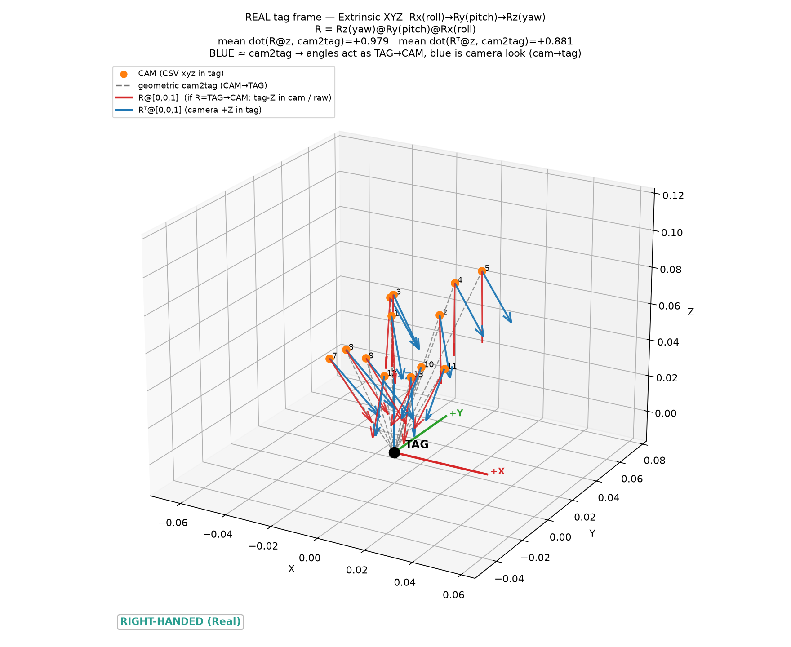
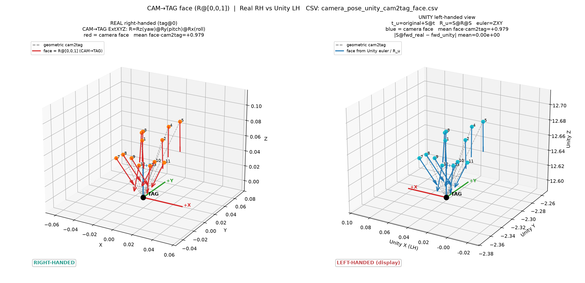

# Real CSV → Unity 相机姿态转换说明

本文档记录从真实测量 CSV 到 Unity 左手系姿态的正确流程、用 Unity 导出验证姿态，以及用 **tag 图像**（TestPhoto 先去畸变再与 Unity 对比）检查像素 / XYZ 偏差。

> **Real 照片（非 tag）** 的坐标映射、FOV scale 与 XY(+3,+1) mm 对比见：[`samplePhoto2/REAL_PHOTO_POSE_AND_COMPARE.md`](samplePhoto2/REAL_PHOTO_POSE_AND_COMPARE.md)。两套脚本请勿混用。

**唯一正确的 Unity 输出 CSV：** `camera_pose_unity_cam2tag_face.csv`  
**再生脚本：** `regen_unity_cam2tag_face.py`  
**Unity 自动应用与导出：** `PoseCsvAutoCapture.cs`  
**Tag 图像对比：** `compare_testphoto_undist_vs_unity.py` → `compare_out/testphoto_undist_vs_unity/`

---

## 1. 输入 CSV（Real / 右手系）

文件：`camera_pose_relative_to_tag.csv`

| 列 | 含义 |
|----|------|
| `camera_x_mm`, `camera_y_mm`, `camera_z_mm` | 相机在 **tag 坐标系**下的位置（毫米） |
| `camera_roll_deg`, `camera_pitch_deg`, `camera_yaw_deg` | **CAM→TAG** 外参，Extrinsic **XYZ** |

### 角度约定（重要）

CSV 里的 roll / pitch / yaw **不是** TAG→CAM，而是：

$$
R_{\mathrm{cam2tag}} = R_z(\mathrm{yaw})\, R_y(\mathrm{pitch})\, R_x(\mathrm{roll})
$$

即世界/tag 系下：先绕 X 转 roll，再绕 Y 转 pitch，再绕 Z 转 yaw（外参 XYZ）。

相机光轴（局部 $+Z$）在 tag 系中的朝向：

$$
\mathbf{f}_{\mathrm{real}} = R_{\mathrm{cam2tag}}\, [0,\,0,\,1]^{\mathsf{T}}
$$

几何上相机指向 tag 原点的方向：

$$
\mathbf{v}_{\mathrm{cam2tag}} = -\, t_{\mathrm{cam}},\qquad
t_{\mathrm{cam}} = (x,\,y,\,z)_{\mathrm{mm}} / 1000
$$

校验指标：

$$
\mathrm{look\_dot} = \mathbf{f}\cdot\hat{\mathbf{v}}_{\mathrm{cam2tag}}
$$

本数据集均值约 **+0.979**（接近 1，光轴大致对准 tag）。

### Real 坐标系示意



---

## 2. Real → Unity 变换

场景中 tag 锚点（Unity world）：

```text
original = (0.03160001, -2.3284, 12.5992)
```

手性对齐用 X 翻转相似变换：

$$
S = \mathrm{diag}(-1,\, 1,\, 1)
$$

### 位置

$$
t_{\mathrm{unity}} = \mathrm{original} + S\, t_{\mathrm{cam}}
$$

### 旋转

$$
R_{\mathrm{unity}} = S\, R_{\mathrm{cam2tag}}\, S
$$

在本约定下 **不需要** 额外的 `Rx(180)`。Unity 默认 identity 时 forward = world $+Z$，与上式一致后 `R_unity` 的第三列即为相机 forward。

### Unity Euler / 四元数

从 $R_{\mathrm{unity}}$ 提取：

1. **四元数** `(x, y, z, w)`（Unity 顺序；约定 $w \ge 0$，避免 $q$ 与 $-q$ 随机翻转）
2. **Euler** `(unity_rot_x, unity_rot_y, unity_rot_z)`：与 `Quaternion.Euler` 相同，即 **ZXY**（先 Z，再 X，再 Y）

$$
R_{\mathrm{Euler}} = R_y(y)\, R_x(x)\, R_z(z)
$$

写入 CSV 的列：

| 列 | 用途 |
|----|------|
| `unity_pos_x/y/z` | `transform.position` |
| `unity_quat_x/y/z/w` | **推荐** `transform.rotation` |
| `unity_rot_x/y/z` | 备选 `transform.eulerAngles`（勿与 CSV 的 roll/pitch/yaw 直接对比） |

### Real vs Unity 对比图



两侧 mean $\mathrm{face}\cdot\mathrm{cam2tag} \approx +0.979$，且

$$
\lVert S\, \mathbf{f}_{\mathrm{real}} - \mathbf{f}_{\mathrm{unity}} \rVert = 0
$$

说明位置经 $S$ 对齐后朝向一致。

---

## 3. 在 Unity 中应用与验证

### 应用

1. 把 `PoseCsvAutoCapture.cs` 挂到 Camera 上。
2. CSV 路径指向 `camera_pose_unity_cam2tag_face.csv`。
3. 脚本优先用 `unity_quat_*` 设置 `transform.rotation`（`applied_via=quaternion`）。
4. 录制输出目录会写出 RGB / Depth，以及：

```text
unity_camera_quat_export.csv
```

### 导出列含义

| 列 | 含义 |
|----|------|
| `csv_quat_*` | 从输入 CSV 读入的四元数（即算出的 `unity_quat_*`） |
| `unity_quat_*` | 应用后现场 `transform.rotation` |
| `euler_*` | 现场 `transform.eulerAngles` |
| `quat_dot_abs` | $\lvert q_{\mathrm{csv}}\cdot q_{\mathrm{unity}}\rvert$，应为 **1** |
| `applied_via` | 应为 `quaternion` |

### 验证判据

1. **四元数**：对每一帧 $\lvert q_{\mathrm{calc}}\cdot q_{\mathrm{live}}\rvert \approx 1$（角差 $\ll 0.1^\circ$）。  
   $q$ 与 $-q$ 表示同一旋转，用绝对值点积即可。
2. **Euler**：算出的 `unity_rot_*` 与导出的 `euler_*` 应一致（到浮点精度）。  
   **不要**拿 CSV 原始 `roll/pitch/yaw` 去和 Unity Euler 比数字——约定不同（Extrinsic XYZ vs Unity ZXY），且存在万向节等价角。
3. **朝向几何**：`look_dot_unity` 应与 `look_dot_real` 同号、同量级（本数据约 +0.98）。

### 已验证结果（本仓库）

对 `unity_camera_quat_export.csv` 与 `camera_pose_unity_cam2tag_face.csv` 对比：

- `applied_via = quaternion`
- 全部 13 帧 `quat_dot_abs = 1.000000`
- 算出的 quat / euler 与 Unity 现场值一致

离线对比脚本：`compare_export_now.py`（或 `compare_unity_quaternions.py`）。

---

## 4. Tag 图像对比：TestPhoto（先去畸变）vs Unity

姿态四元数对齐之后，用 **tag 外观** 检查 Real 照片与 Unity 渲染是否还有像素级 / XYZ 偏差。

### 输入

| 侧 | 路径 | 说明 |
|----|------|------|
| Real | `TestPhoto/CamCoordTest_{i}.jpg` | 真实拍摄，有镜头畸变 |
| Unity | `camera_pose_unity_facing_xyz/CamCoordTest_{i}_Unity.jpg` | 按 `camera_pose_unity_cam2tag_face.csv` 采集；建议 **1080×720** |

### 相机标定（去畸变用）

Brown–Conrady（OpenCV 顺序 `k1,k2,p1,p2,k3`）与内参矩阵：

```text
k1 = -0.38898088
k2 =  0.15099531
p1 = -0.00301529
p2 =  0.00057045
k3 = -0.02746219

K = [[762.7627033,   0.0,         661.53817354],
     [  0.0,         763.78023472, 360.37587777],
     [  0.0,           0.0,           1.0      ]]
```

已写入 `capsule_intrinsics.npz`，也可供 `undistort_images.py` 使用。

### 流程

1. 用上述 $K$ + dist 对 TestPhoto **先 `cv2.undistort`**（Unity 为针孔、无畸变）。
2. 将去畸变 Real 与 Unity 缩到工作分辨率，用边缘 NCC 搜索：旋转 $\{0^\circ,180^\circ\}$ × 各向异性 scale × FFT 平移。
3. 对最优对齐后的 Unity 与 undistorted Real 做 **blend** 与 **absdiff**（逐像素 $|I_{\mathrm{und}}-I_{\mathrm{unity}}|$）。
4. 用像素位移在 tag 深度上近似 XYZ（相机坐标系）：

$$
\Delta X \approx \frac{d_x}{f_x}\, Z,\qquad
\Delta Y \approx -\frac{d_y}{f_y}\, Z,\qquad
\Delta Z \approx \Big(\frac{1}{s}-1\Big)\, Z
$$

其中 $d_x,d_y$ 为把 Unity 对齐到 Real 所需的平移（像素），$s$ 为平均 scale，$Z$ 为该帧 $|t_{\mathrm{cam}}|$。  
**注意：** $\Delta Z$ 与 FOV / 分辨率混叠，解读要谨慎；$\Delta X,\Delta Y$ 更可靠。

### 命令与输出

```bash
python compare_testphoto_undist_vs_unity.py
```

输出目录：`compare_out/testphoto_undist_vs_unity/`

| 文件 | 内容 |
|------|------|
| `undistorted_testphoto/CamCoordTest_*_undist.jpg` | 去畸变后的 Real |
| `compare_{i}.png` | 六格对比条（见下） |
| `{i}_absdiff.png` | 单独差值图 |
| `compare_summary.csv` | 每帧 rot / scale / shift / NCC / mean absdiff |
| `triage_all.png` | 全部帧缩略总览 |

每张 `compare_{i}.png` 从左到右：

1. real raw  
2. real undistorted  
3. unity raw  
4. unity rot180（仅对比时试转，**不改**磁盘上的 Unity 原图）  
5. blend（undistorted + 最优对齐后的 Unity）  
6. absdiff（二者相减的绝对值）

示例（第 2 帧）：


### 本仓库最新结果（Unity 1080×720）

| 指标 | 值 |
|------|-----|
| 最优旋转 | 13/13 选 **rot=180**（图像平面内上下关系仍需排查） |
| edgeNCC 均值 / 中位 | **0.42 / 0.41**（明显高于 640×480 采集） |
| mean $\|I_{\mathrm{und}}-I_{\mathrm{u}}\|$ | 约 **72**（0–255） |
| 近似 $\Delta X,\Delta Y,\Delta Z$（中位） | 约 **−3 mm, −1 mm, +15 mm** |

结论（针对 **tag**）：

- 姿态链路正确后，tag 大致同框，仍有约数毫米级 **X 向系统性平移**，Y 很小；Z 的 +1.5 cm 更像 scale/FOV，不宜单独当平移。
- 对比脚本里的 **180°** 是对齐搜索项；若 rot180 长期全面胜出，应检查 Unity 相机 up / 采集朝向，而不是只改 XYZ。

---

## 5. 再生命令

```bash
python regen_unity_cam2tag_face.py
```

会覆盖：

- `camera_pose_unity_cam2tag_face.csv`
- `real_vs_unity_cam2tag_face.png`

Real 侧单独检查图：

```bash
python plot_real_cam_extrinsic_xyz.py
```

→ `real_extrinsic_xyz_cam_vectors.png`

Tag 图像对比（先 undistort 再 compare）：

```bash
python compare_testphoto_undist_vs_unity.py
```

→ `compare_out/testphoto_undist_vs_unity/`

---

## 6. 保留 / 已清理的文件

### 保留（正确链路）

| 文件 | 角色 |
|------|------|
| `camera_pose_relative_to_tag.csv` | 输入（Real） |
| `camera_pose_unity_cam2tag_face.csv` | Unity 姿态（正确） |
| `unity_camera_quat_export.csv` | Unity 现场验证导出 |
| `camera_pose_unity_facing_xyz/` | Unity 采集的 tag RGB/Depth |
| `capsule_intrinsics.npz` | 去畸变 $K$ + dist |
| `real_vs_unity_cam2tag_face.png` | 两坐标系对比 |
| `real_extrinsic_xyz_cam_vectors.png` | Real 外参检查图 |
| `compare_out/testphoto_undist_vs_unity/` | Tag 图像对比结果 |
| `regen_unity_cam2tag_face.py` | 转换脚本 |
| `compare_testphoto_undist_vs_unity.py` | Tag：undistort → compare |
| `PoseCsvAutoCapture.cs` | Unity 应用 + 导出 |

### 已删除（历史错误变换）

`TestPhoto/` 下旧版 `camera_pose_unity*.csv` 已全部删除，包括曾用过的：

- `camera_pose_unity0.csv`、`_v2`、`_final`、`_simple`、`_zfixed` …
- `camera_pose_unity_S.csv`、`_cam2tag.csv`、`_from_tag2cam.csv`
- `camera_pose_unity_facing_cam2tag.csv`、`_facing_xyz.csv`
- `*_extrinsic*`、`*_intrinsic*`、`*_lookat*`、`*_euler180*`、`*_x180*` 等

那些文件基于错误语义（例如把角度当成 TAG→CAM、多余 `Rx(180)`、或旧 Euler 路径），**不要再用**。

---

## 7. 公式速查

```text
# 输入
t_cam = (x_mm, y_mm, z_mm) / 1000
R     = Rz(yaw) @ Ry(pitch) @ Rx(roll)     # CAM→TAG ExtXYZ
face  = R @ [0,0,1]

# Unity
S       = diag(-1, 1, 1)
t_unity = original + S @ t_cam
R_unity = S @ R @ S
quat    = from R_unity  (x,y,z,w), prefer w>=0
euler   = Unity ZXY from quat   -> unity_rot_x/y/z
```
