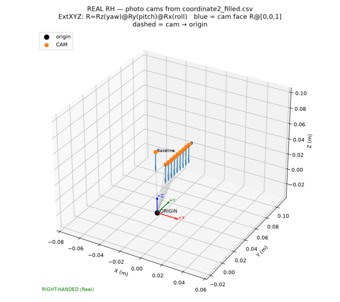
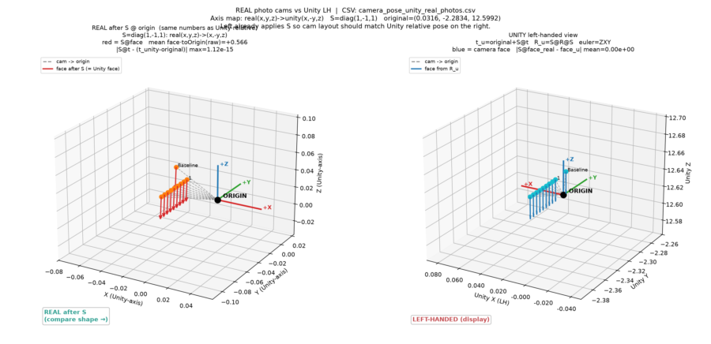
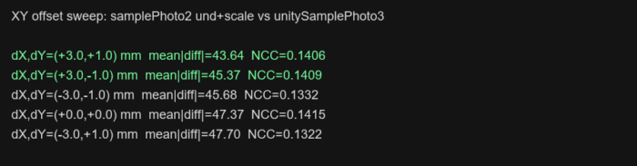
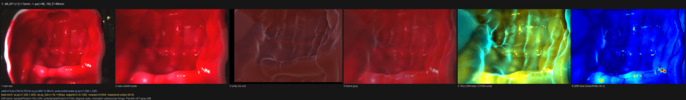
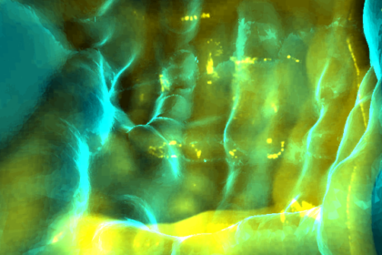

# Real 照片姿态转换与图像对比（非 Tag）

本文档只描述 **samplePhoto2 真实照片** 链路，与根目录 `UNITY_POSE_CONVERSION.md`（tag）分开。  
当前推荐做法：CSV→Unity 姿态 + **tag 估出的 FOV scale** + 相机平移 **(+3 mm, +1 mm)**。

---

## 1. 输入 CSV

文件：`coordinate2_filled.csv`

| 列 | 含义 |
|----|------|
| `CamX/Y/Z` | 相机相对原点位置（mm） |
| `CamRoll`, `CamPitch`, `CamYaw` | 朝向；**Extrinsic XYZ**：先 Roll→Pitch→Yaw |
| `photo#` | `Baseline`, `1`…`9` |

$$
R = R_z(\mathrm{yaw})\, R_y(\mathrm{pitch})\, R_x(\mathrm{roll}),\qquad
\mathbf{f} = R\,[0,0,1]^{\mathsf{T}}
$$

---

## 2. Real → Unity 坐标（与 tag 不同）

| 项 | 值 |
|----|-----|
| 轴映射 | real $(x,y,z)$ → unity $(x,-y,z)$ |
| $S$ | $\mathrm{diag}(1,-1,1)$ |
| 原点锚点 | `original = (0.03160001, -2.2834, 12.5992)` |

$$
t_{\mathrm{cam}} = (CamX,CamY,CamZ)/1000,\quad
t_{\mathrm{unity}} = \mathrm{original} + S\, t_{\mathrm{cam}},\quad
R_{\mathrm{unity}} = S\, R\, S
$$

再从 $R_{\mathrm{unity}}$ 得到 `unity_quat_*`（推荐）与 Unity ZXY `unity_rot_*`。

**脚本（仅 real，勿混用 tag 脚本）：**

```bash
python convert_real_cam_to_unity.py
```

| 输出 | 说明 |
|------|------|
| `camera_pose_unity_real_photos.csv` | Unity pos / euler / quat（含 `image_file`） |
| `real_cam_vectors.png` | Real 相机位置与朝向 |
| `real_vs_unity_real_photos.png` | Real after $S$ vs Unity LH |





校验：`|S@face_real − face_unity| = 0`。Unity 侧用 `PoseCsvAutoCapture.cs`，CSV 指到本文件即可（已兼容 `image_file` / `photo`）。

---

## 3. Unity 姿态回读验证

采集目录示例：`../unitysamplephoto2/`（或你的录制文件夹）里的 `unity_camera_quat_export.csv`。

```bash
python compare_real_unity_export.py
```

本仓库结果：10 帧 `applied_via=quaternion`，`|q_calc·q_live|≈1`，euler 差≈0，位置误差≪1 mm。

---

## 4. 图像对比流程（推荐）

Real：`samplePhoto2/{id}.jpg`（无 Baseline 真图）  
Unity：`../unitySamplePhoto3/{id}_Unity.jpg`  
**不旋转 180°。**

### 4.1 标定去畸变

$$
K=\begin{bmatrix}762.76&0&661.54\\0&763.78&360.38\\0&0&1\end{bmatrix},\quad
\mathrm{dist}=[k_1,k_2,p_1,p_2,k_3]
$$

$k_1=-0.38898,\ k_2=0.15100,\ p_1=-0.00302,\ p_2=0.00057,\ k_3=-0.02746$  
（见 `../capsule_intrinsics.npz`）

### 4.2 Tag 得到的 FOV scale（加在 undistort 之后）

Tag 对比里 Unity 需缩小到约 `sx,sy≈(0.77,0.82)` 才能对齐 und → Real und 放大：

$$
s_x\approx 1.2935,\quad s_y\approx 1.2264
$$

中心缩放、保持 1080×720。

### 4.3 XY 平移扫描（mm）

在深度 $Z=|t_{\mathrm{cam}}|$ 上把相机位移换成像素，平移 Unity 图再比：

$$
d_x = \frac{\Delta X_{\mathrm{mm}}\, f_x}{Z_{\mathrm{mm}}},\quad
d_y = -\frac{\Delta Y_{\mathrm{mm}}\, f_y}{Z_{\mathrm{mm}}}
$$

试过：`(0,0)`, `(-3,-1)`, `(+3,+1)`, `(-3,+1)`, `(+3,-1)`。

| 排名 | ΔX, ΔY (mm) | mean\|diff\| | edgeNCC |
|------|-------------|--------------|---------|
| 1 | **(+3, +1)** | **43.6** | 0.141 |
| 2 | (+3, −1) | 45.4 | 0.141 |
| 3 | (−3, −1) | 45.7 | 0.133 |
| 4 | (0, 0) | 47.4 | 0.142 |
| 5 | (−3, +1) | 47.7 | 0.132 |

**当前采用：scale + ΔX=+3 mm、ΔY=+1 mm。**  
（相对无偏置略好；逐帧最优并不完全一致，整体仍明显差于 tag 对齐。）



---

## 5. 命令与结果目录

### 再生 Unity CSV + 坐标系图

```bash
cd samplePhoto2
python convert_real_cam_to_unity.py
```

### 图像对比（scale，可选从 tag summary 读）

```bash
python compare_samplephoto_undist_vs_unity.py ^
  --unity-dir unitySamplePhoto3 ^
  --from-tag-summary ../compare_out/testphoto_undist_vs_unity/compare_summary.csv
```

→ `../compare_out/samplephoto2_undist_scaled_vs_unitySamplePhoto3/`

### XY 扫描（含推荐 +3,+1）

```bash
python sweep_xy_offset_vs_unity3.py
```

→ `../compare_out/samplephoto2_xy_offset_sweep_unitySamplePhoto3/`

| 子目录 | 含义 |
|--------|------|
| `dxp0mm_dyp0mm/` | 无 XY 偏置 |
| `dxp3mm_dyp1mm/` | **推荐 +3,+1 mm** |
| `dxm3mm_dym1mm/` 等 | 其它组合 |
| `offset_sweep_summary.csv` | 汇总排序 |

每组内：`compare_{id}.png`（含黄/青差值）、`{id}_yellow_cyan.png`。

差值配色：**samplePhoto2 = 黄，Unity = 青**；对齐偏白，错位黄/青描边。





---

## 6. 与 Tag 链路对照（勿混用）

| | Tag | Real 照片（本文） |
|--|-----|-------------------|
| 输入 | `camera_pose_relative_to_tag.csv` | `coordinate2_filled.csv` |
| $S$ | $\mathrm{diag}(-1,1,1)$ | $\mathrm{diag}(1,-1,1)$ |
| original Y | −2.3284 | **−2.2834** |
| 转换脚本 | `regen_unity_cam2tag_face.py` | `convert_real_cam_to_unity.py` |
| 对比脚本 | `compare_testphoto_undist_vs_unity.py` | `compare_samplephoto_undist_vs_unity.py` |
| 文档 | `../UNITY_POSE_CONVERSION.md` | **本文** |

---

## 7. Depth 训练数据导出（方式 1）

Real 正向 undistort + tag scale；Unity RGB/**Depth** 做同一 XY 平移（默认 +3,+1 mm）；再按重叠区裁剪。

```bash
python export_depth_train_pairs.py --unity-dir unitySamplePhoto3
```

→ `../compare_out/depth_train_pairs_unitySamplePhoto3/`  
`{id}_real.png` / `{id}_unity.png` / `{id}_depth.png` / `{id}_mask.png` + `manifest.csv`

说明：当前 Unity Depth 导出是可视化 uint8，不是米制深度；但与 RGB **几何同步**。默认 `crop_mode=fixed_min`（全集最小重叠尺寸居中裁）。

---

## 8. 公式速查

```text
# pose
t = (CamX,CamY,CamZ)/1000
R = Rz(yaw) @ Ry(pitch) @ Rx(roll)
S = diag(1,-1,1)
t_u = original + S @ t
R_u = S @ R @ S

# image (current recipe)
und = center_scale(undistort(real, K, dist), sx=1.2935, sy=1.2264)
unity_shift = shift(unity, px_from_mm(+3, +1, Z))   # then optional NCC refine
# compare und vs unity_shift  (no rot180)
```
